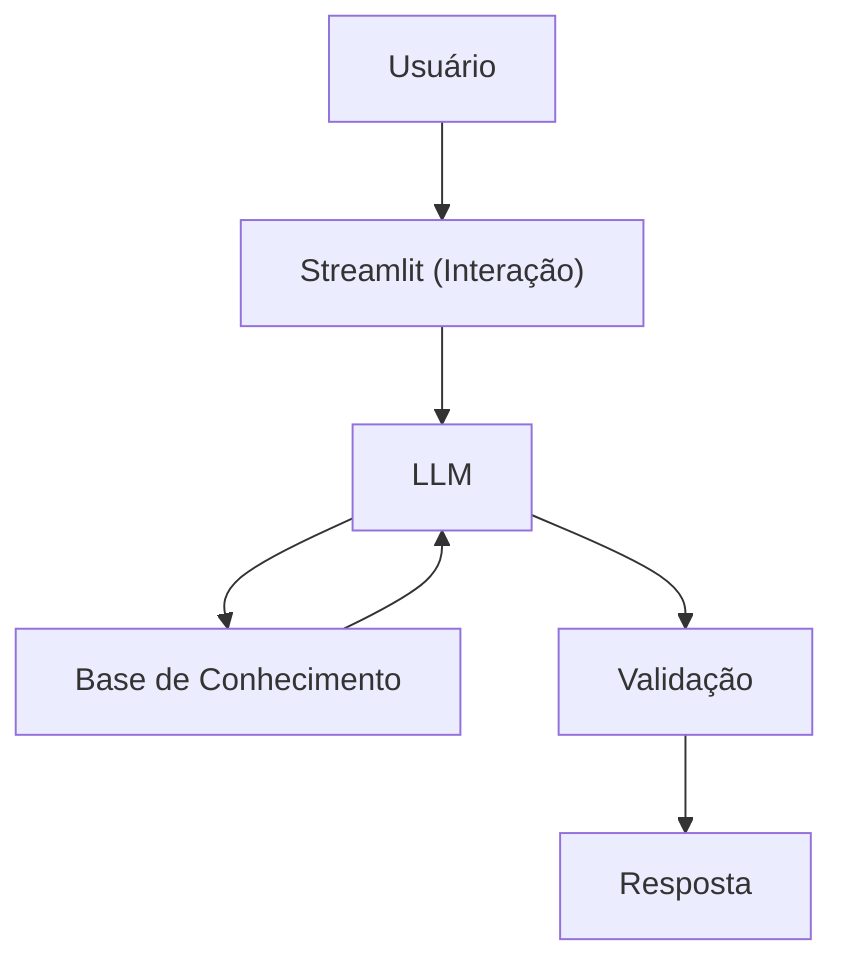

# 💰 Finance (Fin) — Agente Financeiro Inteligente

O **Finance (Fin)** é um agente virtual inteligente focado em educação financeira, desenvolvido com Python, Streamlit e IA generativa.

O objetivo do projeto é ajudar usuários a entender melhor seus hábitos financeiros, tomar decisões mais conscientes e evoluir sua relação com dinheiro de forma simples, amigável e personalizada.

---

## 🚀 O que o projeto faz

- Explica conceitos financeiros de forma simples  
- Analisa dados do usuário (perfil, transações e histórico)  
- Responde dúvidas sobre gastos e investimentos  
- Atua de forma consultiva, educativa e não prescritiva  
- Utiliza contexto real para gerar respostas personalizadas  

---

## 🧠 Diferencial do agente

O Fin **não recomenda investimentos diretamente**.

Em vez disso, ele:
- Explica opções disponíveis  
- Contextualiza com base no perfil do usuário  
- Incentiva decisões conscientes  
- Atua como um educador financeiro digital  

---

## 🏗️ Arquitetura do Projeto

### Diagrama



```bash
📁 src/
└── app.py

📁 data/
├── perfil_investidor.json
├── transacoes.csv
├── historico_atendimento.csv
└── produtos_financeiros.json

📁 docs/
├── 01-documentacao-agente.md
├── 02-base-conhecimento.md
└── 03-prompts.md
```


---

## 🧩 Como o agente funciona

O Fin combina três pilares principais:

### 1. Contexto do usuário
- Perfil financeiro  
- Objetivos  
- Transações  
- Histórico de atendimento  

### 2. Base de conhecimento
- Conceitos de educação financeira  
- Estrutura de produtos financeiros  
- Regras de interpretação  

### 3. System Prompt
- Linguagem simples e amigável  
- Respostas curtas e objetivas  
- Proibição de recomendação direta  
- Uso de dados do usuário  
- Estímulo à continuidade da conversa  

---

## 💬 Exemplos de uso

O agente responde perguntas como:

- “Para onde está indo meu dinheiro?”  
- “O que é inflação?”  
- “Quero começar a investir”  
- “Tenho R$1000, quais opções existem?”  

---

## 🛠️ Tecnologias utilizadas

- Python  
- Streamlit  
- Pandas  
- Requests  
- Ollama (LLM local)

---

## ▶️ Como rodar

```bash
# 1. Instalar dependencias
pip install streamlit pandas requests
ou
python -m pip install streamlit pandas requests

# 2. Garantir que o Ollama esta rodando
ollama serve

# 3. Rodar o app
streamlit run .\src\app.py
ou
python -m streamlit run.\src\app.py
```
## Evidencia de Execução


---

## 🎯 Objetivo

Projeto desenvolvido para explorar:

- IA Generativa
- Construção de agentes inteligentes
- Engenharia de prompt
- Uso de contexto estruturado
- Aplicação em finanças pessoais
  
---

## 📌 Próximos passos
- Implementar memória de conversa
- Evoluir personalização
- Expandir base de conhecimento
- Melhorar experiência do usuário

---

## 👨‍💻 Autor
### Renan Decamini
